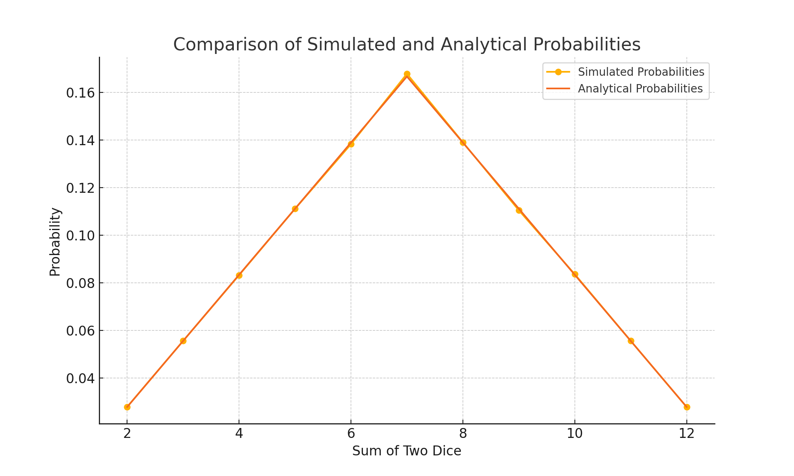

# Dice Roll Simulation - Monte Carlo Method

## Task- 7

## Introduction
This project simulates the rolling of two dice a large number of times (1,000,000) using the Monte Carlo method. The objective is to calculate the probabilities of each possible sum (from 2 to 12) and compare the simulated probabilities with the analytical probabilities.

## Results

### Comparison Table

Sum | Simulated Probability | Analytical Probability
--- | --------------------- | ---------------------
2 | 2.7823% | 2.7778%
3 | 5.5548% | 5.5556%
4 | 8.3183% | 8.3333%
5 | 11.1056% | 11.1111%
6 | 13.8229% | 13.8889%
7 | 16.7807% | 16.6667%
8 | 13.9020% | 13.8889%
9 | 11.0444% | 11.1111%
10 | 8.3561% | 8.3333%
11 | 5.5570% | 5.5556%
12 | 2.7759% | 2.7778%

### Plot

## Conclusion
The Monte Carlo simulation results are remarkably close to the analytical probabilities. This demonstrates that the Monte Carlo method is effective for estimating probabilities in scenarios involving randomness, such as rolling dice.

- The most common sum is 7, with the highest probability (approximately 16.67% analytically and very close to this value in the simulation).
- The least common sums are 2 and 12, with the lowest probabilities (approximately 2.78% analytically and very close to this value in the simulation).

Overall, the simulated probabilities match the analytical probabilities closely, validating the accuracy of the Monte Carlo simulation approach for this problem.
